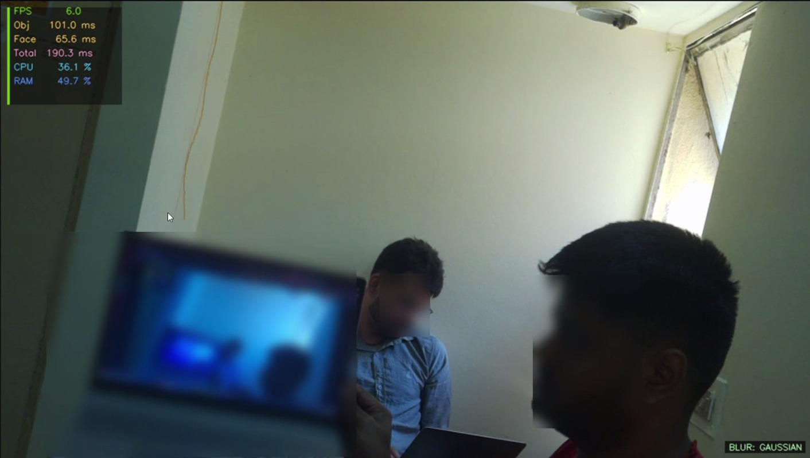
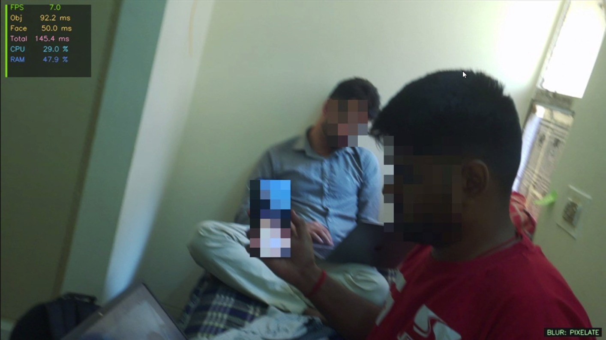

# Real-Time Privacy Preservation on Edge Devices

**Edge AI Course – Project Report**

---

## 1. Problem Statement, Motivation & Objectives

Modern workplaces, homes, and public spaces increasingly rely on cameras for monitoring and video conferencing. These environments frequently capture sensitive personal information — human faces, laptops with visible screens, and mobile phones — without consent or awareness. Transmitting raw video feeds to cloud servers for processing raises significant privacy concerns, introduces latency, and creates exposure to data breaches.

Edge AI offers a compelling solution: inference runs entirely on-device, ensuring sensitive visual data is never transmitted off-premises. Real-time blurring of privacy-sensitive objects at the source eliminates the cloud dependency, reduces latency, and ensures compliance with privacy regulations such as GDPR.

**Key Objectives:**
- Detect faces, laptops, and mobile phones in real-time video streams using YOLOv8
- Apply selective blurring (Gaussian, Pixelation) to detected regions
- Deploy the full pipeline on a Raspberry Pi 5 with acceptable real-time performance
- Apply model compression techniques (ONNX export, Knowledge Distillation, Quantization) to meet edge constraints
- Stream the processed video via a Flask MJPEG dashboard with live performance metrics

---

## 2. Proposed Solution (Overview)

The system is a two-model, sequential inference pipeline running entirely on a Raspberry Pi 5. Frames are captured from a Pi Camera Module, passed through two YOLOv8 models (one for faces, one for laptops/mobiles), blurred in detected regions, and streamed live to any browser via Flask MJPEG.

**Pipeline:**

```
Pi Camera (Picamera2)
        ↓
  Frame Capture Thread
        ↓
  YOLOv8 Face Detection  ─────────────┐
        ↓                             │
  YOLOv8 Object Detection             │  Bounding boxes
  (laptop, mobile/TV)  ───────────────┘
        ↓
  Blur Engine
        ↓
  Blurred Frames
        ↓
  Flask MJPEG Stream → http://<pi-ip>:5000
        ↓
  Browser Dashboard (FPS, latency, CPU, RAM, detections)
```

**Blur modes available:** Gaussian, Pixelate, Median, Box Blur,Stack Blur
---

## 3. Hardware & Software Setup

### Hardware
| Component | Details |
|---|---|
| Edge Device | Raspberry Pi 5 (4-core ARM Cortex-A76, 8GB RAM) |
| Camera | Pi Camera Module (IMX708 sensor) |
| Interface | Browser-based MJPEG dashboard over WiFi |

### Software
| Tool / Framework | Purpose |
|---|---|
| Python 3.11 | Primary language |
| Ultralytics YOLOv8 | Object detection models |
| Picamera2 | Pi Camera capture interface |
| OpenCV | Image processing, blur operations |
| ONNX Runtime | Optimised inference on ARM |
| Flask | MJPEG streaming server |
| psutil | System metrics (CPU, RAM) |
| PyTorch | Model training and export |
| Hugging Face Hub | Pre-trained YOLOv8-Face model |

---

## 4. Data Collection & Dataset Preparation

### Dataset Sources
| Split | Source | Images |
|---|---|---|
| Faces | WiderFace dataset | ~32,000 train |
| Laptops / Monitors | COCO 2017 (classes: laptop=63, tv=72) | ~15,050 filtered |
| Custom collected | Self-captured images (various lighting, angles,augumented) | ~500 images |

These datasets were used to infer the latency, IOU and MAP metrics.

### Preprocessing Steps
- COCO filtered to only images containing target classes (class IDs 63 and 72), reducing dataset from 118,000 → ~15,050 images
- Labels remapped to unified class scheme: `{0: face, 1: laptop, 2: tv}`
- WiderFace annotations converted to YOLO format (normalised xywh)
- Custom 150 images labelled manually using edge impulse and added to validation split

---

## 5. Model Compression & Efficiency Metrics

### Techniques Applied

| Technique | Applied To | Details |
|---|---|---|
| Dynamic INT8 Quantization | TFLite models | Weight-only quantization applied without calibration dataset; used for initial benchmarking |
| Static INT8 Post-Training Quantization | TFLite models | Full integer quantization using calibration on ~50 representative frames for improved accuracy and stability |     
| Input Resolution Reduction | Both models | 320×320 (vs default 640×640) — ~4× fewer pixels, reducing computational load |
| Framework Comparison | ONNX vs TFLite | Performance evaluated across ONNX Runtime and TFLite Interpreter to determine optimal deployment backend |


### Compression Results ( deployed in RPI)

The  dynamic quantization reduced only the size of the model not its latency . 
The static quantization reduced both the size and latency of the model . 

Based on the comparative analysis across deployment formats, the TFLite implementation for static quantization demonstrated superior performance in terms of inference speed and efficiency. Therefore, the TFLite format was selected for deployment on the edge device.


---

## 6. Blurring Techniques Comparison & Selection

### Techniques Evaluated

The following blurring techniques were evaluated for privacy filtering:

- Gaussian Blur (single-pass and multi-pass)
- Box Blur
- Median Blur
- Pixelation
- Stack Blur

Each method was tested across different kernel sizes and configurations to analyze the trade-off between computational efficiency and visual privacy strength.

---

### Performance Comparison (Representative Results)

| Technique | Configuration | Avg Latency (ms) | FPS | CPU Usage (%) | Remarks |
|---|---|---|---|---|---|
| Gaussian Blur | k=51 | ~11.8 | ~84.7 | ~91 | Good blur quality, moderate cost |
| Box Blur | k=51 | ~1.3 | ~768 | ~17 | Extremely fast, weak blur |
| Box Blur | k=101 | ~1.5 | ~672 | ~20 | Fast but low privacy strength |
| Median Blur | k=21 | ~15.0 | ~66.9 | ~98 | Good edge preservation, high CPU |
| Median Blur | k=51 | ~27.2 | ~36.7 | ~99 | Strong blur, expensive |
| Pixelation | block=10 | ~0.84 | ~1186 | ~20 | Very fast, acceptable privacy |
| Pixelation | block=20 | ~0.81 | ~1234 | ~25 | Fastest, slightly coarse output |
| Stack Blur | k=51 | ~1.78 | ~562 | ~85 | Good balance of speed and smoothness |
| Stack Blur | k=101 | ~2.23 | ~447 | ~76 | Slightly stronger blur, still efficient |

---

### Key Observations

- **Pixelation** achieved the highest FPS with minimal computational cost, making it highly suitable for real-time applications  
- **Box Blur** was extremely fast but provided insufficient privacy protection  
- **Gaussian Blur** produced the best visual quality but was computationally expensive, especially for large kernels  
- **Median Blur** preserved edges well but consumed significant CPU resources  
- **Stack Blur** provided a strong balance between blur quality and computational efficiency  

---

### Final Selection & Design Decision

> Based on the trade-off between latency, computational load, and privacy effectiveness, **Pixelation and Stack Blur were selected as the primary blurring techniques for deployment**.

Additionally, it was observed that **the latency introduced by blurring operations is negligible compared to the inference latency of the AI models**. As a result, the choice of blurring technique has minimal impact on the overall system performance.

This insight enabled the adoption of an **adaptive blurring strategy**, where different blur types are applied based on object characteristics without significantly affecting real-time performance:

- Mobile phones → Pixelation (fast and sufficient privacy)
- Laptops / screens → Stack Blur or moderate Gaussian Blur
- Faces → Strong blur (Gaussian or Stack Blur depending on required intensity)

This adaptive approach ensures an effective balance between **privacy preservation and computational efficiency**, while maintaining real-time performance on edge devices.

---


## 7. Model Deployment & On-Device Performance


### Deployment Steps

1. Trained and quantized model exported to TensorFlow Lite format (`model.tflite`) from Google Colab  

2. Deployment package organised into modular structure:  
   - `model/` → contains `model.tflite`  
   - `src/` → contains inference script (`main.py`)  
   - `requirements.txt` → lists required dependencies  

3. Deployment folder transferred to Raspberry Pi using SCP or external storage  

4. Required dependencies manually installed on Raspberry Pi using: pip install opencv-python numpy tflite-runtime flask picamera2 --break-system-packages  

5. TFLite model loaded in `main.py` using TensorFlow Lite Interpreter  

6. Real-time inference pipeline executed directly using: python src/main.py  

7. Detected privacy-sensitive objects (laptop, TV, mobile phone, face) and applied class-specific blurring  

8. Processed output streamed via Flask server and viewed in browser interface

9. The same deployment pipeline was implemented using both sequential execution and parallel multi-threading approaches for performance comparison  . 


### On-Device Performance Summary (Threading Model)

We then experimented with parallelizing the pipeline using three threads:
one for camera capture, one for model inference, and one for display/encoding.
Threading was evaluated on INT8 static quantised `.tflite` models.

| Model      | Format    | CPU%  | Combined FPS (Pi 5) |
|------------|-----------|-------|---------------------|
| Sequential | `.tflite` | ~30%  | ~7.0                |
| Threading  | `.tflite` | ~90%  | ~6.0                |

---

### Why Threading Backfired

Despite the Pi 5 having 4 cores, threading did not improve throughput.
The root causes were:

**1. Python GIL (Global Interpreter Lock)**
Python only allows one thread to execute bytecode at a time.
Even with 3 threads, execution is interleaved — not truly parallel.
While tflite's `invoke()` does release the GIL at the C++ level,
the surrounding Python overhead (pre/post-processing, decode, encode)
still serialises on a single core.

**2. Cache Thrashing**
The Pi 5's L2 cache is 512KB per core. Each tflite model is ~3MB.
Every context switch between threads evicts model weights from cache.
When inference resumes it must reload weights from RAM,
paying a cold-start penalty on every switch.
Sequential mode never evicts weights mid-inference — the working
set stays warm in cache across the full forward pass.

**3. CPU% is Misleading**
`psutil.cpu_percent()` reports the average across all 4 cores:
Sequential:  1 core ~100% + 3 cores idle  →  reported ~25-30%
Threading:   all 4 cores active but ~30% of cycles wasted on
                 context switching overhead   →  reported ~90%
Higher CPU% in threading does not mean more useful work —
it means more overhead.

---

### Trade-offs Observed

- Parallel thread execution on Pi 5 caused CPU starvation —
  sequential was more stable and ~1 FPS faster
- Both models competed for the same 4 cores and shared memory bus,
  increasing latency rather than reducing it
- Thread context switches caused repeated cache misses on model weights,
  adding overhead that outweighed any parallelism benefit

**Key finding:** Parallel execution backfired on Pi 5 —
sequential single-loop inference was faster, more stable,
and used significantly less CPU.

---
## 8. System Prototype

*Gaussian blurring on laptops and faces*

*Pixel blurring on phones and faces*
---


## 9. Conclusions & Key Insights

### Key Outcomes
- Successfully deployed a privacy-preserving vision system on Raspberry Pi 5 using TFLite models.
- Implemented a multi-model pipeline for detecting privacy-sensitive objects with adaptive blurring.
- Achieved ~7 FPS using INT8 quantized models, enabling near real-time performance on edge devices.
- TFLite provided the best performance compared to ONNX and PyTorch for edge deployment.
- Multiple blurring techniques were implemented and analysed.

### Key Insights
- Model inference dominates total latency, while blurring contributes minimally.
- Adaptive blurring is practical since it does not significantly affect performance.
- Sequential execution outperforms parallel threading on Raspberry Pi due to CPU limitations.
- INT8 quantization significantly improves FPS (~2x–3x) with acceptable accuracy trade-off.

---

## 10. Limitations & Future Scope

### Limitations
- Even at ~7 FPS, performance is below standard real-time video requirements (24 FPS).
- System is limited by CPU-only execution (no GPU/NPU acceleration).
- Parallel inference is inefficient due to CPU resource contention.
- Detection accuracy depends on dataset quality and coverage.

### Future Scope
- Integrate hardware accelerators (TPU/GPU) to improve FPS.
- Apply pruning and lightweight architectures for further optimization.
- Develop a unified multi-task model to reduce pipeline latency.
- Improve dataset diversity for better robustness and accuracy.
- Expand blurring to includer other sensitive objects like documents,number plates etc.

---


## 11. Challenges & Mitigation

| Challenge | Details | Mitigation |
|---|---|---|
| Parallel inference backfired | ThreadPoolExecutor caused CPU starvation on 4-core Pi 5 | Reverted to sequential; Pi 5 lacks sufficient cores for true parallel YOLO |
| Train/deploy environment mismatch | Models developed on Colab CPU produced different confidence scores, latency, and FPS when deployed on Pi 5 | Benchmarked and validated all metrics directly on-device; Colab used only for training, all performance numbers quoted from Pi 5 runs |
| Dataset incompatibility between models | The object model (COCO) and face model (WiderFace) use different annotation formats, class indices, and label schemas — a unified dataset combining both did not exist |Optimised each model independently on its native dataset; both models run in the same inference pipeline at runtime but are benchmarked, tuned, and evaluated separately — object detection metrics reported against COCO, face detection metrics reported against WiderFace |

---

## 12. Future Work

- **Unified single-model** — train one YOLOv8 model for all 3 classes (face, laptop, phone) to eliminate duplicate inference overhead; estimated 40–50% latency reduction
- **Quantization Aware Training (QAT)** — INT8 from the start of training for better accuracy/speed trade-off
- **Streaming resolution** — higher resolution output (1080p) with region-of-interest inference to maintain FPS
- **Additional sensitive classes** — ID cards, whiteboards, passports

---


## 13. References

1. Jocher, G. et al. (2023). *YOLOv8 by Ultralytics*. https://github.com/ultralytics/ultralytics
2. Arnabdhar. *YOLOv8-Face-Detection* (HuggingFace). https://huggingface.co/arnabdhar/YOLOv8-Face-Detection
4. Hinton, G., Vinyals, O., Dean, J. (2015). *Distilling the Knowledge in a Neural Network*. NeurIPS Workshop.
5. Jacob, B. et al. (2018). *Quantization and Training of Neural Networks for Efficient Integer-Arithmetic-Only Inference*. CVPR.
6. Han, S. et al. (2015). *Learning both Weights and Connections for Efficient Neural Networks*. NeurIPS.
7. Redmon, J. & Farhadi, A. (2018). *YOLOv3: An Incremental Improvement*. arXiv:1804.02767.
8. Lin, T.-Y. et al. (2014). *Microsoft COCO: Common Objects in Context*. ECCV.
9. Yang, S. et al. (2016). *WIDER FACE: A Face Detection Benchmark*. CVPR.
10. *Novel Compression Framework for YOLOv8: Structured Pruning and Channel-Wise Distillation*. arXiv:2509.12918.
11. *Systematic Literature Review of Lightweight YOLO Models*. PeerJ, 2025.
12. ONNX Runtime Documentation. https://onnxruntime.ai/docs/
13. Picamera2 Documentation. https://datasheets.raspberrypi.com/camera/picamera2-manual.pdf
14. Raspberry Pi 5 Documentation. https://www.raspberrypi.com/products/raspberry-pi-5/

---

### Video Presentation :- https://indianinstituteofscience-my.sharepoint.com/:f:/g/personal/mprasanna_iisc_ac_in/IgB0AUifHJHpQpazl4oW8iO9AbqCGy9n4O094sr7lrIEORo?e=OvjB5e